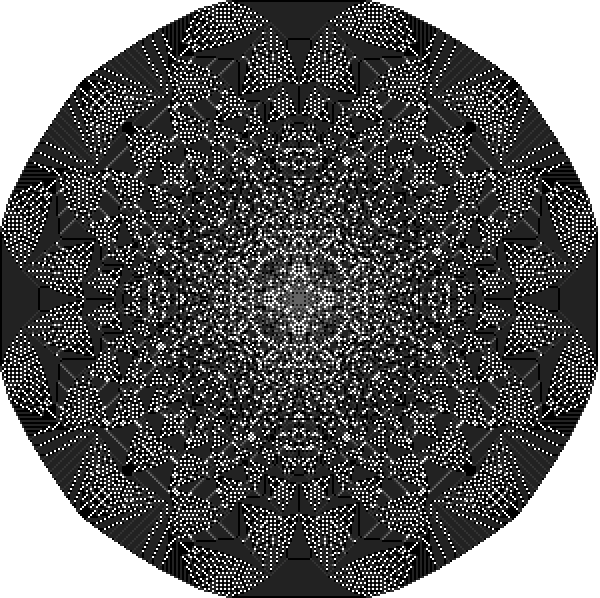

# sandpiles

A `p5.js` & `Typescript` implementation of a fascinating area of mathematics called [sandpiles](https://en.wikipedia.org/wiki/Abelian_sandpile_model).

[Demo](https://sandpiles-cutaiar.netlify.app)

## Development

Uses [parcel](https://parceljs.org/).

`npm start` for hot reloading dev experience on localhost

`npm build` for prod build
